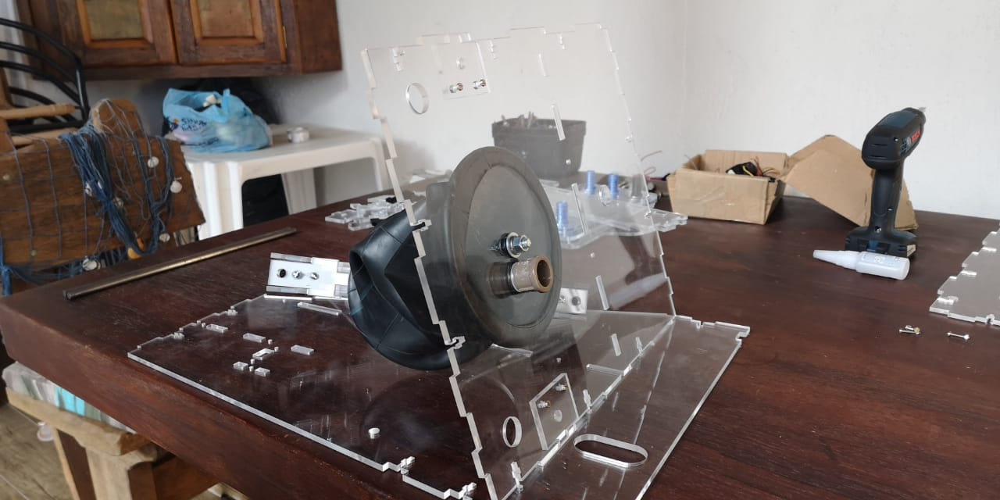
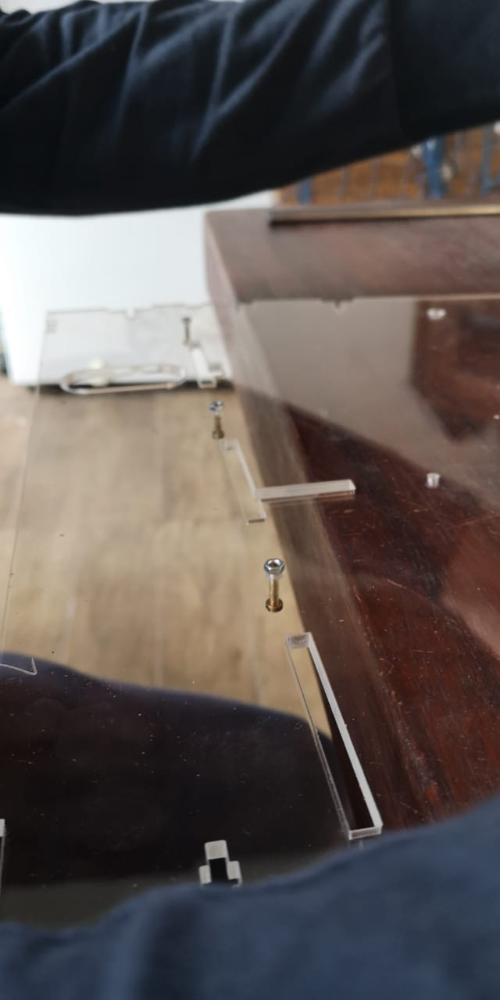
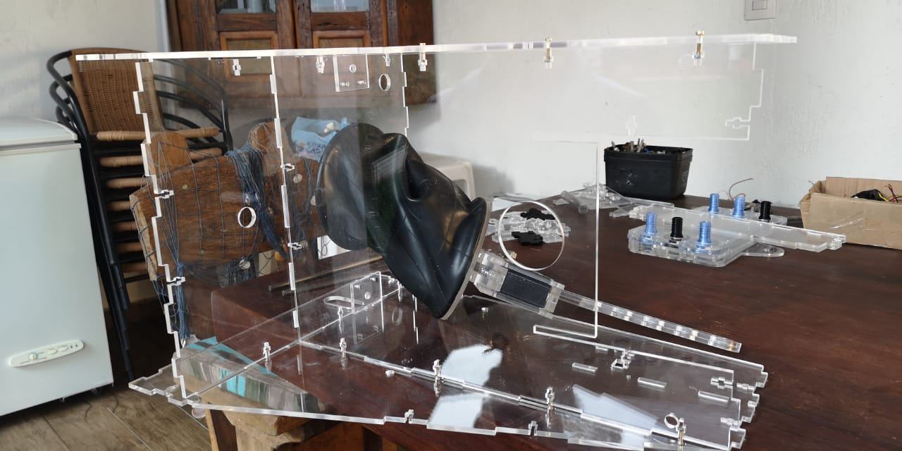
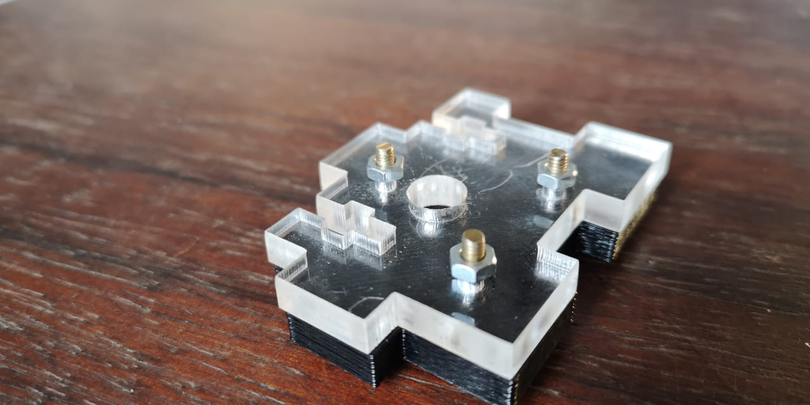
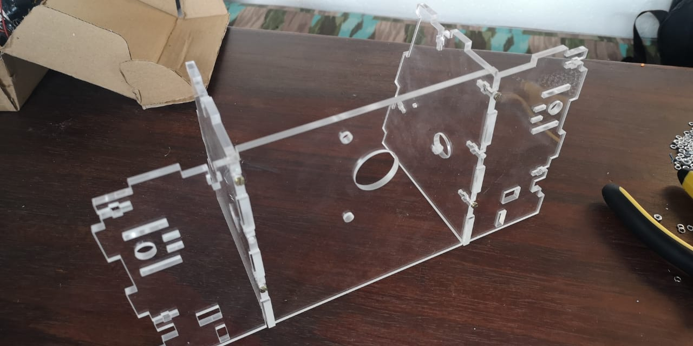
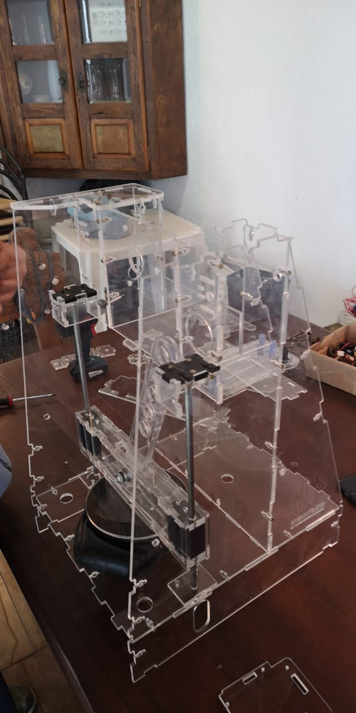

**Frame Assembly**

FIRST READ THE COMPLETE MANUAL!

This is a very complicated part of the assembly. Altought it has several ways to be accomplished we reached so many dificulties on this step. This is why we recommend to assembly first the Bellow and the Gantry.

You can start by assembling on the lateral pannels the Linear Rod end-idler. This is important to be made first because the main frame chassi is perpendicular to this structure

Other problem you are going to find is to insert the rod in the gantry-carriage and the same time aligning the rod-idler with the lateral chassi and the main chassi. 

If you chassi is made of acrilic you may be able to bend it altought if made on other material you won't be able. This is why we are going to release a new version for metal plates to be cutted on StainlessStell or other Materials

Start by using the Main Frame, the lateral Frame and the base to build an X, Y and Z plane corner. This will stabilize the structure

You can use the M3 x 15mm screw and nuts to fix this parts

If you install them and let the nut very unfasten it is possible to just click the entire pice at once

You can try to bend a little bit very gently the structure to make it fit all together. We recomend that you

Assemble the other side pannel

You can now inser the rods into the linear bearings. Notice in the bottom part that the IDLERs where already installed in the base

It should look like this. 

Here are the Idler parts. Insert the screws and leave the nuts on the part that has the hole. 

The top Idler is made of to pieces. One with a hole for the ROD and other that will lock the ROD so it doesn't move. Also is important to notice that we 3D printed this part. But you can use a Laser Cutted one

You can fix them before inserting the stabilization frame. This is very important. Gently bend a little bit the acrilic so you can assemble it

It should look like this

This is the Stabilization Frame already assembled. It is preatty straight forward. Insert it gently bendind just the necessary parts of the acrylic. 

Ok The main parts are done. It should look like this

You can proceed now to the [MOTOR ASSEMBLY](../Motor/MotorAssembly.md)