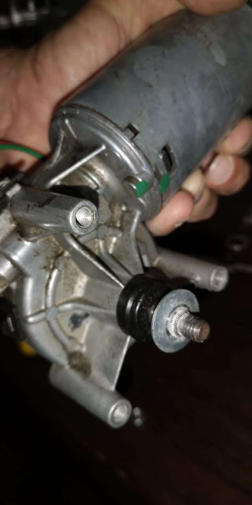
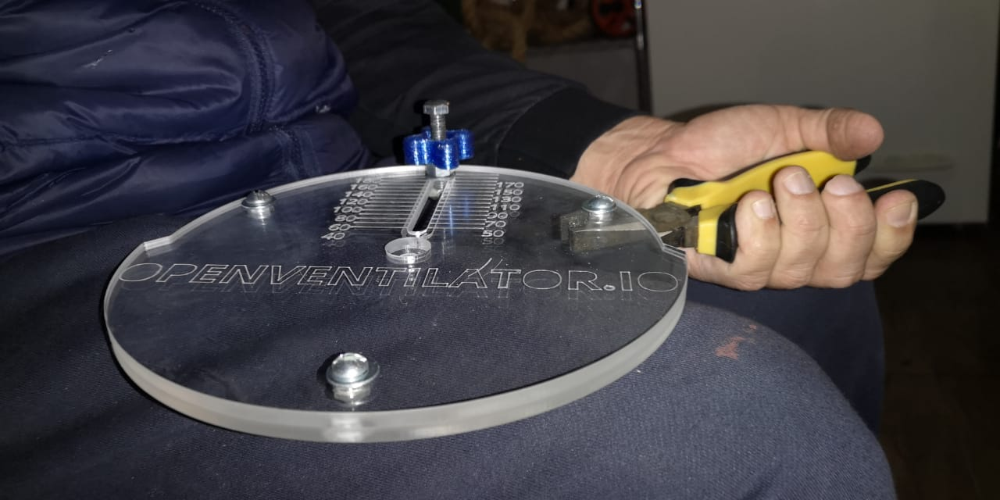
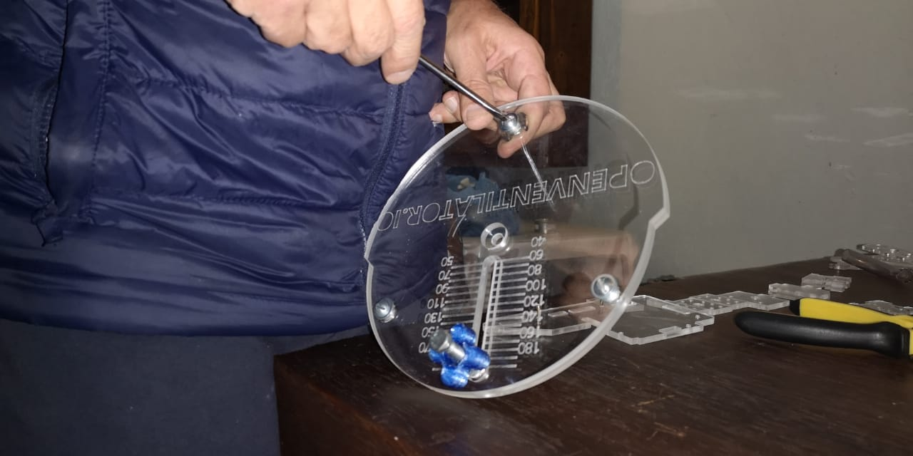

**Motor Assembly**

**Part List**
-   Motor [This are the motors we tested](https://github.com/popsolutions/openventilator/tree/master/02_Pump/WindscreenWiperMotors)
-   3x Screws
-   1x Washer (The Inner Diameter should be less than the size of the the shaft diameter of the motor)
-   1x Nut (Our case and example is an 8mm Nut)
-   3x M5 Screws x 15mm
-   3x M5 Nut (A lower high is recommended like a 3mm nut to avoid colision on the backpart of the Crank Disk)

Start by inserting the washer into the shaft. This washer is responsible by holding the CrankWheel and don't allow it to slip on the shaft movement.

Also notice that the Washer don't allow to touch the back part of the motor and keeps a distance from it

Check if the holes to fix the motor on the frame are in the correct position, you can use a marker or a sharpie to mark the holes and drill it with a Driller. Be sure to be gentile as the Acrylic can crack with over pressure and also to use the exact SCREW DIAMETER on the BIT diamenter

Now you can assembly the 2 CrankDisks Wheels, they have differant characteristics, but the important thing to notice is that the screw head goes on the side that have the ruler with the numbers. 

Align the center to be exatcly co-centric

After that you can use the correct tools to tight the screw and fix the 2 disks

