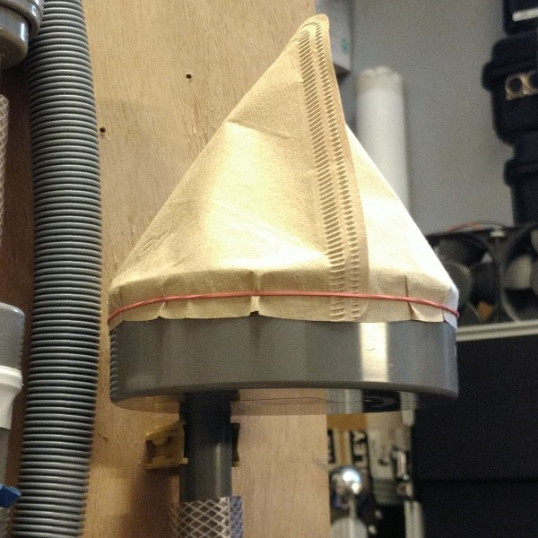
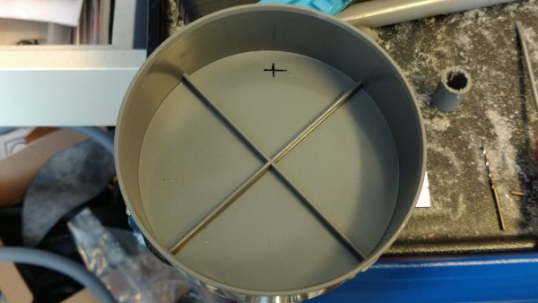
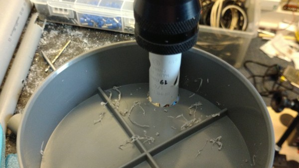
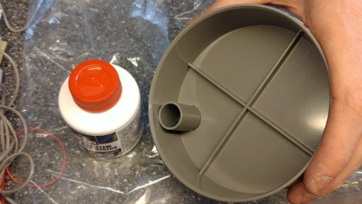

 **OPEN VENTILATOR**

# Filter

2020-05-09

This filter housing is made to work with coffee filters or flat fabric-like filter material.

You can make this is many ways, this is only an example that works.

# Required materials

- A 110 mm PVC cap

- A 80 mm long 19 mm (3/4") electricity pipe (use 16 mm (5/8") if you use 16 mm hoses)

- A click-in clamp fitting the above tube to mount the filter against a wall

- Coffee filter or other/better filter material.

- Elastic band fitting around a 110 mm pipe

# Required tools

- Metal saw (to saw the PVC)

- Electrical hand drill

- Hole saw of 19 mm (3/4") or 16 mm (5/8") if you use 16 mm hoses

# Build procedure

Time: 0:05 to 0:10

Create/saw a piece of 80 mm 19 mm tube. 

Mark a hole inside the cap such that a pipe put in a hole there will just touch the outside of the cap (see further pictures).

Drill a 2.5 or 3 mm hole there. Then hole-saw the 19 mm hole.

Glue the pipe in by first putting it in too deep. Put glue on it, and quickly but carefully pull it out to the final position while rotating slightly. 

Put the coffee or other filter over the cap, and put the elastic band over. Mount the click-in clamp where you want to mount the filter and click the filter in.

