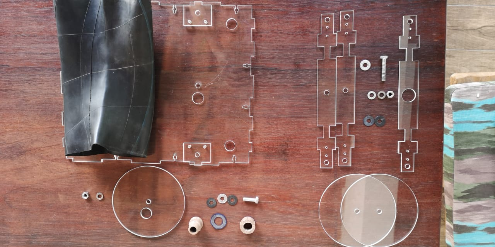

**Bellow Assembly**

Start by assembling the bottom part of the Bellow. The Base and the Disk should press the Car Tire Chamber on each other. This pressure will garantee that there is no leakage. Also notice the importance of the O-rings and washer as they will also guarantee that air doesn't leak in the system. 

[The Washer and o-rins must be cutted as shown in the Cutting O-Rings.](../O-Rings/CuttingOrings.md)

Notice that we have in this Order

Screw>O-ring>Washer>O-ring

The Begining by the base is because the top part must me tighten by rotating the base of the gantry that will be screw to the disk set in the top part of the bellow. If you assemble the top part first you won't be able to screw the tubing connections that are in the bottom part. Please follow the steps as shown on the figures

After passing the Screw trough the base you can tightit a little just hold firmly in place the disk

Having the disk aligned with the base is time to insert the 1/2in tubbing conections, male and female. Don't forget the oring cutted specially for this part

Screw and thight the nut so with the pressure we make the bottom part of the bellow airsealed

Make the same procedure for the TOP Part of the Bellow. It is important that you hold the screw inside the bellow trought the rubber so it doesn't fall down

After this step you can go to 

[**GANTRY ASSEMBLY**](../Gantry/GantryAssemblyPart2.md).