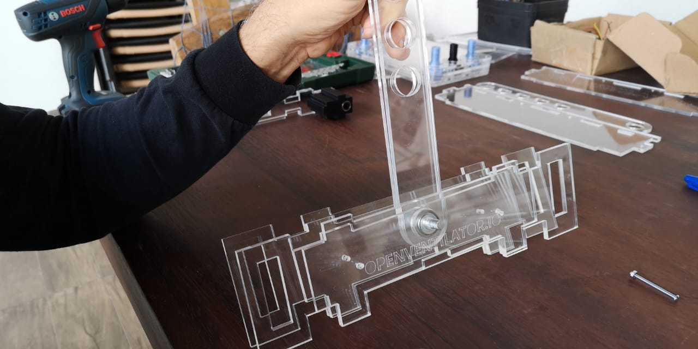

**Gantry Assembly**

**Part List**

Insert the linear Bearings into the bearing case (3D printed or laser cutted)

You can fix now the upper part of the Gantry to the bearings carriage

Than start the assembly

Start it with the 8mm x 50mm screw.

Insert the Screw trought the acrilic plate with the washers, bearings as show in the photo sequence.

Insert the connecting lever on the 602 bearings

Finish the Installation with a pressure washer and the nut. 

Do not tight the gantry set yet. We will need to finish the bellow to connect with the bottom part of the Gantry. See that we have the screws unfasten in the image above

Insert the top part that you assembled in the begining

At the end it should look like this before you go to the next step

After kindly inserting the top part of the Gantry Go to the [BELLOW ASSEMBLY MANUAL](../BellowAssembly/BellowAssembly.md)

# Gantry Assembly part 2 (after bellow assembly)

Please just follow this steps after you have finished the Bellow Assembly. Make sure that the Logo on the Gantry is front oriented.

Also notice that the screws on the back on the gantry should not have an over size as they will colide with the Ventilator Structure

Use the M3 long screw to fix the TOP and Bottom part of the Gantry
.jpeg)

You can now finish the Gantry assembly by thingting the Main 8mm Screw and the 2x M3 assistant screws. 

It should look like this after finished

[**NOW PROCEED TO THE FRAME ASSEMBLY](../Frame/FrameAssembly.md)
