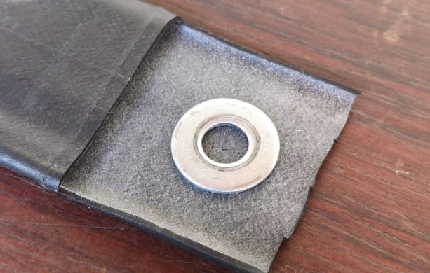

**Making O-Rings for the Bellow System**

**Part List**
- Tire Chamber Snip
- 1x Washer 8mm ID x 20mm OD
- Scissors
- Marker or Pen

It is very important that this O-rings are well made as they will be responsible for maintaining the pressure inside the bellow, prevent leak and therefore are **Critiacal Mission** part component of the system. 

Do not be intimidated, although they are made with the flaps of the tire chamber, these rings, if well made, can last for a few months.

It is very important as you can see in the photos that the O-Rings are based on washers. Let's make the O-ring from prints drawn with a pen on the tire chamber of the washers with an inner diameter of 8mm and an outer diameter of 20mm

Notice that you have to bend the rubber disk to cut in the middle

After cutting the o-ring, verify that the inner diamenter is slightly bigger than the diameter of the screw. If rubber get between the treads of the screw and the nut we can have lickage

Also with one of the tube connections we will need to cut a bigger o-ring that will be used on the base of the bellow. (Fig)

[NOW PROCEED TO THE GANTRY ASSEMBLY](../Gantry/GantryAssembly.md)