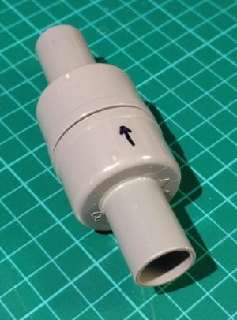
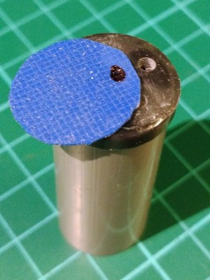
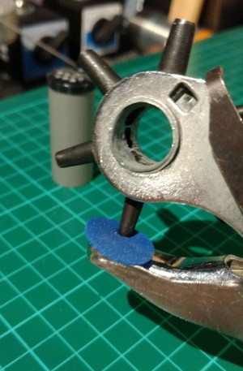
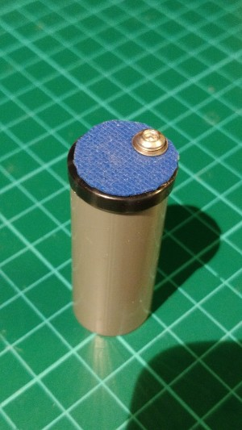
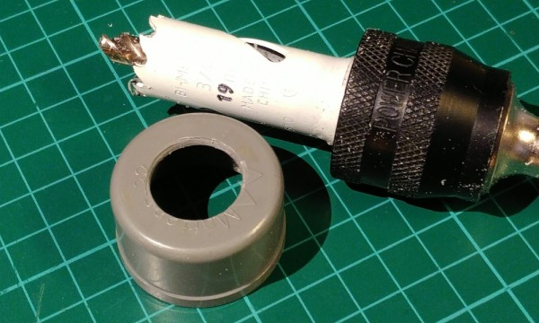
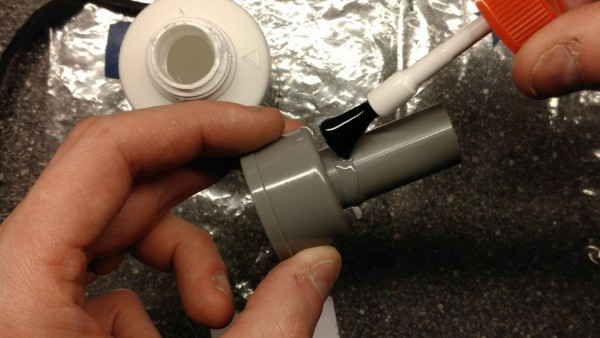

 **OPEN VENTILATOR**

# PVC one-way valve

2020-05-04

This is a one-way valve (or check valve) for low pressure air.

# Required materials

- 2 PVC end caps for 32 mm pipes

- Short piece of 32 mm PVC pipe

- Short piece of 19 mm PVC electricity pipe (or 16 mm if you use 16 mm tubing)

- Some flexible gasket material such as a piece of swimming cap or silicon oven glove

- A (stainless) short bolt M3 (M3x4, M3x6, M3x8 or M3x10)

- A (stainless) washer M3

- PVC glue

- Super glue

# Required tools

- Metal saw

- Metal file

- Hole deburr cone (can be done with knife too)

- Marker pen fine (and perhaps also medium)

- Electric drill, if possible drill press

- Drill bit of 2.5 mm

- Hole saw of 19 mm (or 16 mm if you use 16 mm tubing)

- Leather belt hole puncher (or other way to make a 3 mm hole)

# Build procedure

Create/saw a 35 mm piece and a 45 mm piece of 19 mm PVC tube.

Make the ends straight (90°) and smooth with the file and hole deburr tool.

Take a button (for clothing) of just over 19 mm diameter.

Drill out the holes to 2.5 mm, and add more holes of 2.5 mm, except on one side.

On that side, only one hole of 2.5 mm is needed (see picture left). Make sure the screw fits within the 19 mm tube when the button is placed on top of the tube.

Tap the single hole to M3.

Put PVC glue on the top of the tube of 45 mm. Put the button on top of the tube. Use enough glue to make sure it is sealed.

Mark a circle of 19 or 20 mm on the swimming cap with the fine marker pen, the size depending on the diameter of the used button. If you don’t have a circle template, you can use the 19 mm tube.

Cut it out with a pair of scissors. This will be the membrane.

Put the circle on the button, find the place of the screw hole and mark it with a marker (medium or fine). Punch a 3 mm hole with a hole puncher.

Put a small drip of superglue between the screw hole and the edge of the button. Place the membrane on the button. Place the washer with the round side down, sharp side up, on the hole in the membrane. Screw it in, don’t put it very tight. The membrane should not change shape.

When you have it in place, put a drop of super glue on the bolt at the side of the edge of the button. Immediately release the bolt half a turn and immediately tighten it again half a turn. This is to get the glue into the bolt.

Drill a 2.5 mm guide hole in the center of both 32 mm PVC end caps. Then use that hole to saw a 19 mm hole in both.

Glue the 35 mm long tube in the first cap with PVC glue. This can be done by glueing the tube first, and then putting it in. It should stick out only very little to the inside. Make sure it is straight by placing the cap on the table and rotating it.

Place the 45 mm long tube in the second cap. This needs to be done from the inside, because the button needs to be on the inside. Put it (almost) with the button against the cap. Put PVC glue tube on the outside, as in the picture on the right. Then pull the tube some 10 mm inside, while rotating it a bit to distribute the glue. Make sure it is straight by placing the cap on the table and rotating it.

Saw a 41 mm or longer end of 32 mm PVC tube. Make the ends clean with the file. Put the end caps on the tube. Try the functionality of the one-way valve by blowing on the ends. When it works well, put tape around the seam. This way you can reopen the valve and clean or inspect it when needed.

