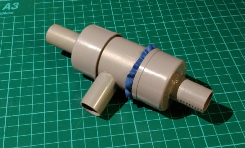
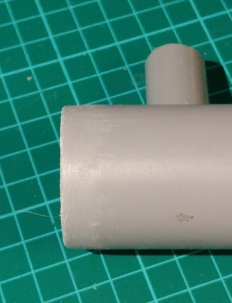
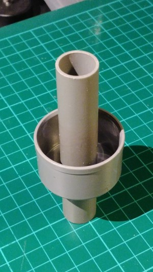
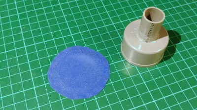

 **OPEN VENTILATOR**

# PVC Transistor valve

2020-05-04

This is a valve that opens the pathway between the "drain" and "source" ports when the "gate" port has a lower pressure than the two other ports. It is only suitable for low pressure air.

It is best to build at least one one-way before this one.

# Required materials

- 2 PVC end caps for 40 mm pipes

- Short piece of 40 mm PVC pipe

- Short piece of 19 mm PVC electricity pipe (or 16 mm if you use 16 mm tubing)

- Some flexible gasket material such as a piece of swimming cap or silicon oven glove

# Required tools

- Metal saw

- Metal file

- Hole deburr cone (can be done with knife too)

- Marker pen fine

- Electric drill, if possible drill press

- Drill bit of 2.5 mm

- Hole saw of 19 mm (or 16 mm if you use 16 mm tubing)

# Build procedure

Create/saw a 35 mm piece, another 35 mm piece and a 100 mm piece of 19 mm PVC tube.

Make the ends straight (90°) and smooth with the file and hole deburr tool.

Drill a 2.5 mm guide hole in the center of **both** 40 mm PVC end caps. Then use that hole to saw a 19 mm hole in both.

Glue the **first** 35 mm long tube in the first cap with PVC glue. It should stick out only very little to the inside. Make sure it is straight by placing the cap on the table and rotating it. This is the "gate" port.

Create/saw a 65 mm piece of 40 mm PVC tube. Make the ends clean with the file. Bevel one side particularly well, so that it visibly has a smaller diameter on the end. This is to make the gasket fit inside together with the tube. Drill a 2.5 mm hole in the side of the pipe at 25 mm from this bevelled end. Saw a 19 mm hole into this 2.5 mm hole.

Glue the second 35 mm long tube into the newly create hole in the side of the 40 mm PVC tube. This is the "source" port.

Take the 100 mm piece of tube and put it through the second cap with a 19 mm hole. It should stick out on the inside just as much as the length of the 40 mm PVC pipe (measure that). Don’t glue it yet. Fit it inside the 40 mm tube and check that it comes exactly until the end of it. Mark around the outside of the cap on the 19 mm tube. You now know where it needs to be glued. Pull it out some 20 mm. Put glue on the tube. Push it back in to the original positionwhile rotating it slightly to distribute the glue. Make sure it is straight by putting it into the 40 mm tube and verifying its position and – more important – flatness. This is the “drain” port.

Mark a circle of some 60 to 80 mm diameter on the gasket material with the fine marker pen.

Cut it out with a pair of scissors. This will be the membrane.

Place the gasket on the tube, and push the cap with the short pipe onto it. Push it a few millimeters on, such that you can feel it wont go off anymore.

Put the other end cap onto the tube as well. Try the functionality of the valve by sucking in and blowing into the drain" and "source" ports. From both ends, the valve should appear as a one-way valve, it opens when blown into. When it works well, put tape around the seam beetween the tube and the "drain" cap. This way you can reopen the valve and clean or inspect it when needed.

