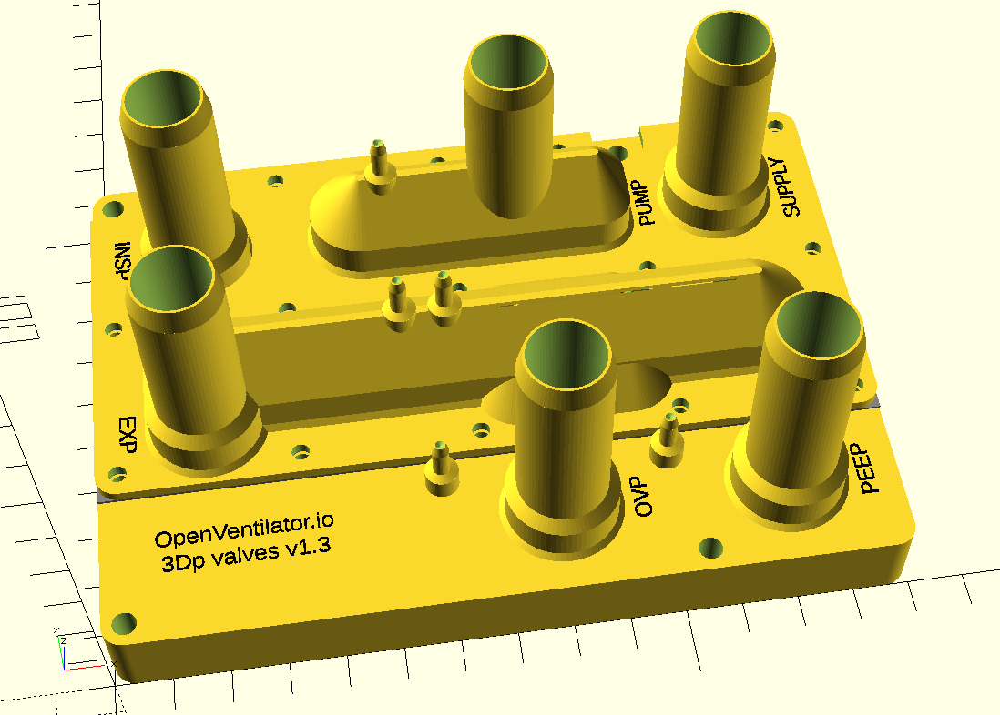

 **OPEN VENTILATOR**

This directory contains a design of a 3D printable valve block. 
This valve block contains all necessary valves for the system.

Version v1.3 is tested and works. 

**This part is not part of the standard Spartan model.**

Follow the [instructions](Instructions.md) if you want to build this valve block.

For a functional description, have a look at the [SystemDescription page](../../SystemDescription.md#pneumatics) where the pneumatics are explained as well.

