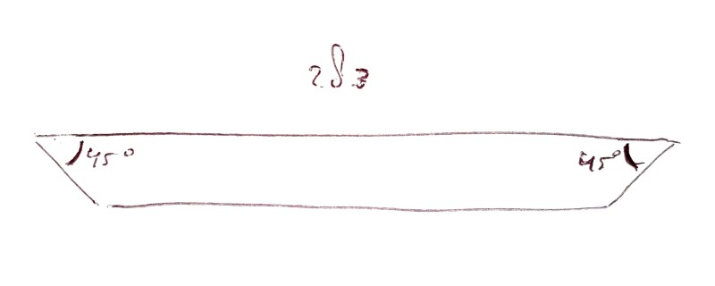
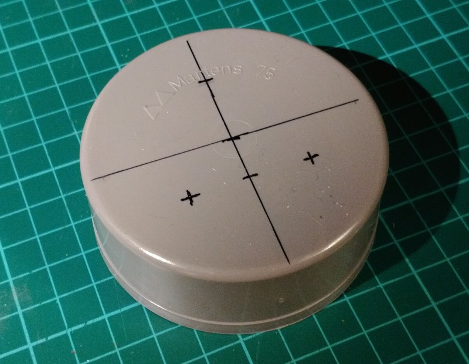
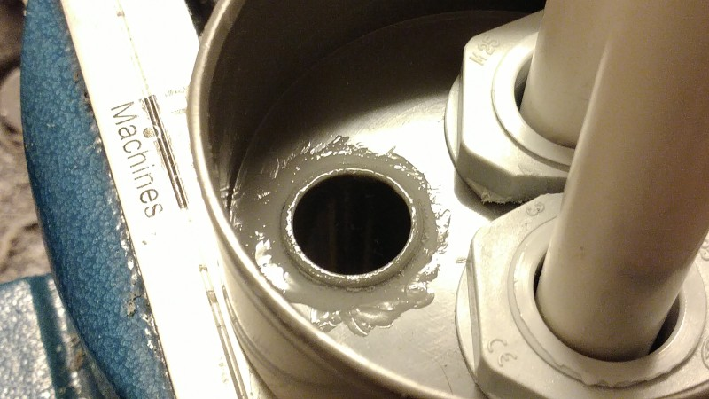
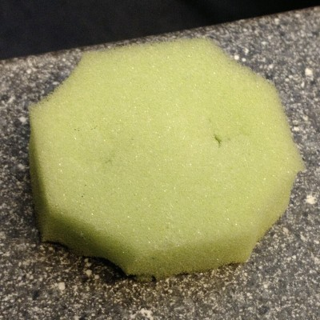
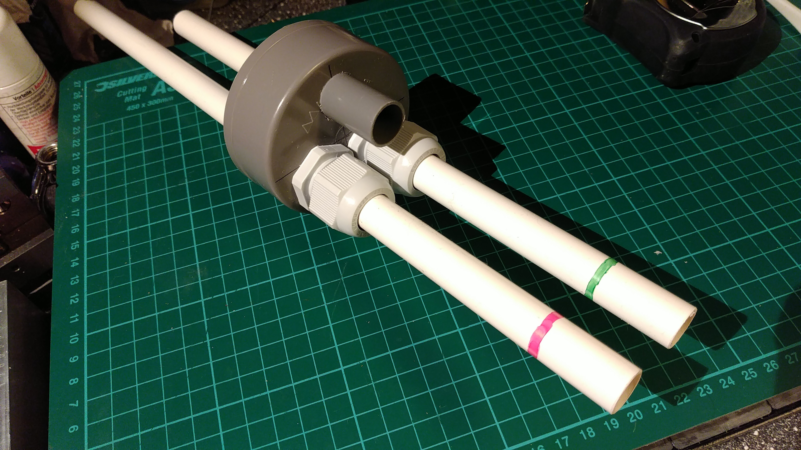
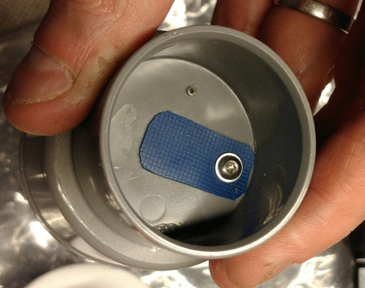
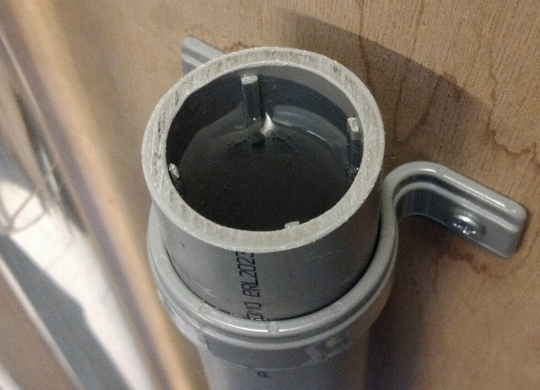
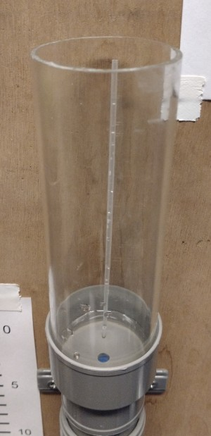

 **OPEN VENTILATOR**

# Regulating water column

2020-05-09

This water column has the following features:

- an overpressure input tube (0 to 50 hPa / cm H2O)

- a PEEP input tube (0 to 30 hPa / cm H2O)

- an exhaust pipe

- is sealed in practise (not perfectly)

- can be made from materials at DIY shops (transparent tube may be more difficult to source, can be bought in online shops)

# Required materials

- 1200x240 mm wood sheet, 10 to 20 mm thick

- Smaller wood beams, at least 20x20mm, just over 600 mm length required

- 1000 mm of transparent PVC, Acrylic or Polycarbonate 50 mm tube

- 500 mm of 40 mm PVC water pipe

- < 150 mm of 19 mm (3/4") PVC electricity pipe (if you use 19 mm hoses in your ventilator only)

- < 90 mm of 16 mm (5/8") PVC electricity pipe (if you use 16 mm hoses in your ventilator only)

- 1600 mm of 16 mm (5/8") PVC electricity pipe (white if possible)

- 2x M25 sealing PVC glands with nuts, normally used for electricity pipes/cables, through which the 16 mm tube above fits.

- A 75mm PVC pipe cap

- A 50mm PVC pipe cap

- A 40mm PVC pipe cap

- A 50mm PVC pipe 90 angle piece with 2 female ends

- A 50mm PVC pipe 90 angle piece with a male and a female end

- A 40 to 50mm PVC adaptor ring.

- A 50 to 75 mm PVC tube adapter (the 75mm cap should fit on it).

- 2x 40 mm PVC tube wall mount bracket (U shape)

- 1x 50 mm PVC tube wall mount bracket (U shape)

- Some PVC glue

- 8x 3.5x30 wood screws (length up to wood sheet thickness + beam thickness)

- 6x shallow wood screws to mount the brackets onto the piece of wood

- A (hollow) deodorant roller ball, diameter just under the inside diameter of the 40 mm tube, which is roughly 33 mm (measure a few balls in the supermarket). In the Netherlands, Nivea balls fit well and are about 29 mm.

- A piece of 10x25 mm of silicon oven glove, silicon swimming cap or thin rubber (if possible thinner than bicycle tire).

- A (stainless) short bolt M3 (M3x4, M3x6, M3x8 or M3x10)

- A (stainless) washer M3

- A small kitchen sponge.

# Required tools

- Wood saw or electrical jigsaw to saw the wood sheet and wood beams

- metal saw (also to saw the PVC)

- Electrical hand drill

- Hole saw of 19 mm (3/4") or 16 mm (5/8") if you use 16 mm hoses

- Hole saw of 25 mm (1")

- Drill bits of 6 mm (or 1/4")

- Screw drivers

- Leather belt hole puncher (or other way to make a 3 mm hole)

# Build procedure

## 1. Wooden stand

Time: 0:05 to 0:20

Create/saw 2 pieces of the small wooden beam of roughly 30 mm (you can choose to make them the same length as the thickness, to look nicer)

Create/saw 2 pieces of the small wooden beam of 283 mm with 45 degree ends (in opposite directions; see drawing).

Wood sheet often comes in standard lengths of 1200 mm. Make a piece of 1200x240 mm. You may choose to make the width wider than 240 to mount more things onto the frame.

From this piece, cut a piece of 300 mm this will be the foot) and one of 900 mm (this is the upright) (these sizes are all not critical).

Put a line at 200 mm from the side of the foot piece. Put the 2 small blocks at the edges just inside the line (see drawing). Screw them tight with the wood screws.

Put the 2 beams with 45 angles at the front of the foot piece, aimed towards a point above the smaller blocks. Screw them tight with the wood screws.

Put the upright on the foot, at the back of the blocks. Screw it on with 4 more screws.

## 2. U-shaped column

Time: 0:05 to 0:20

Glue the two 90 angle pieces together to a U-shape, make sure they are well aligned (press them flat down on a table). Let it cure while doing the following.

Saw/create a piece of 800 mm transparent 50 mm tube. **Always PVC deburr after sawing.**

Saw/create a piece of 500 mm 40 mm PVC tube.

Glue the 40 mm to 50 mm adapter in one of the ends of the created U-shape.

Glue the 400 mm long PVC tube into the 40 mm adapter in the U-shape.

Glue the 800 mm long transparent tube into the other end of the U-shape.

You can adjust the tubes for parallelism while the glue is not cured yet.

## 3. Regulator part 1

Time: 0:05

Take the 40 and 50 mm end caps, and file both flat on the top, because there are often markings on them. It doesn’t have to be perfect, the glue will later fill the remaining space.

Glue both end caps together center-aligned. 

## 4. Pipe entry

Time: 0:15 to 1:00

Saw/create a piece of 900 mm 16 mm white PVC pipe.

Saw/create a piece of 700 mm 16 mm white PVC pipe.

Mark with a waterproof lines 1 to 50 on the long tube, and 1 to 30 on the short tube. For easy reading, make the lines a bit longer at multiples of 5, and place a number there. The value 0 is at the end of the tube, which will be deepest in the water.

Saw/create a 40 mm piece of 16 or 19 mm PVC tube, depending on the size of the hoses in your ventilator.

If you use 19 mm instead of 16 mm hoses on your ventilator, saw/create 2 pieces of 30 mm of 19 mm PVC tube. Then glue these 30 mm pieces over the top ends of the white PVC tubes (so NOT at the side marked by cm lines and numbers).

Prepare the 75 end cap in the following way.

Hole-saw a 19 mm (or 16 of you use 16 mm hoses) hole and two 25 mm holes according to the shown pattern. Pre-drill with 2.5 or 3 mm for precision. Make sure that the tubes will fit in the 50 mm tube. You can use the 75 to 50 mm adapter to find a suitable place.

The nuts of the PVC glands might need to be reduced on one side, or things will not fit (try this). To cut down a PVC nut, clamp it in the vice, and saw one side off. Make sure there is at least 2mm of material left, or it might break.

Put the PVC glands in the 25 mm holes, with the nut on the other side. You may need to tighten the glands by rotating the gland instead of the nut, because of the tight space.

Glue the 19 mm diameter 40 mm long PVC pipe in to the 19 mm hole of the pipe entry. This will be the exhaust.

Insert the white PVC tubes into the glands of the pipe entry, so that around 200 mm stays outside. **Only lightly tighten the glands.**

If the kitchen sponge has a rough side, take that off completely. Use scissors to cut the sponge to a roughly round shape, a bit larger than the transparent tube (8-sided will do). Make 2 holes for the pipes with a small knife, by pushing the blade of the knife through the sponge, making a cross-shaped cut. The sponge will bend around the pipe.

Put the sponge over the white tubes, until some 150 mm from the glands.

## 5. Regulator part 2

Time: 0:10 to 0:45

Take the glued-together combination of 40 and 50 mm caps.

Draw a hole of 6 mm perfectly in the middle of the caps. Predrill it with 2 or 2.5 mm, and drill from the bigger cap to the smaller cap. Deburr this hole very carefully, but not deep, and only in a way that the result has circular symmetry. Basically, there should be no imperfections on the edge of the hole, and the surface around it should be flat. If it's not perfect, the level will not be maintained properly. This may require retrying until it works.

Find a straw between 2 and 3 mm diameter. A ball pen cartridge might work, or a straw from a cannister for air, isopropanol or oil. The opening should be small. This straw will serve to release air from the area near the deodorant ball. The hole should be small to prevent water level changes on the regulator side of the U-shape by temporary water level changes on the other side. Drill a hole of just under the diameter of the straw. Push the straw in, this should be a tight fit. If the hole is too small, drill it with a 0.1 mm larger drill. Alternatively, you can glue it in.

Drill a 2.5 mm hole in the cap at a flat area. Next tap M3 thread in it, but try to keep it tight by not using the final tap, and/or not tapping completely through. This will seal the bolt's thread. Alternatively, you can put glue on the bolt.

Cut a piece of silicon oven glove, swimming cap or very thin rubber to a size of 25 x 10 mm. Punch a 3 mm hole with a hole puncher on one side. 

Place the membrane on the final place, with the smooth side against the hole, and the hole aligned to the created M3 hole. Place the washer with the round side down, sharp side up, on the hole in the membrane. Screw the screw in, don’t put it very tight. The membrane should not change shape. When fixed in place, the membrane should be able to “flap open” a bit. Later the deodorant ball will press against it to close the hole.

The deodorant ball will later be put into the 40 mm tube of the U-shape. The ball might have too much space to move around. Only around 1 mm is allowable. To reduce the space, create thin pieces of PVC and glue them to the inside of the 40 mm pipe. You can for example use slits of 19 mm tube, 30 mm long. This is most easily accomplished by sawing multiple slits into the pipe, 30 mm deep, and then cutting the pipe at 30 mm. Of the small pieces chose the 4 best ones, deburr them and glue them on the inside of the 40 mm tube part of the U-shape. Check that the ball fits through.

Saw/create a piece of 200 mm transparent 50 mm tube. The length is not critical.

Put the 200 mm piece of transparent tube into the 50 mm cap. This is the water container. Mark a line at 40 mm distance from the hole and mark it with “minimum”, and a line at 100 mm distance from the hole with “maximum”, if possible by using stickers. When the regulator has been proven to work, you can glue the transparent tube into the cap.

## 6. Assembly

Time: 0:03 to 0:15

Put the U-shape onto the wooden stand by means of the PVC mounting brackets. Use the shallow wood screws.

Place the 50 to 75 mm tube adapter over the transparent tube (NOT glued). Make sure the sponge is inserted around/between the pipes of the pipe entry. Place the pipe entry cap into the U-shape. This should NOT be glued. If the pipes are very loose, add a single wrap of teflon tape around them, to prevent them from going loose on high exhale volumes caused by coughing or so.

Fill the U-shape with water until it is nearing the top of the 40 mm tube (80% full). Put the deodorant ball in the 40 mm tube. Place the regulator cap on the 40 mm tube. This should also NOT be glued.

Fill the tube further from the regulator, to minimum level. Check that the level in the transparent tube does not go higher than the level of the ball. Put a sticker at this level, marked with “level”. It will rise slightly when the water level in the container is increased to maximum.

# Notes on use

Never tighten the glands very tight. This serves no purpose. Only tighten them so much that the tubes stay well in place.

Small amounts of water may flow out of the tiny hole at the regulator when the level rises too much. Be prepared for this to be possible. This can for example happen when the overpressure tube is used for the first time in a long time.

You may want to put a lid loosely onto the water container to prevent dust etcetera from getting in. Putting a tight lid on will push water through the membrane, so that's not a good idea.

In a later modification I replaced the tubes by 15 mm transparent tubes, and put a 15 mm hose on them to create 19 mm hose connections. The transparent tubes don't need marks on them, but do need a cm marked background behind the tube (a template for this is present). With transparent tubes you can both set and read the pressure.

