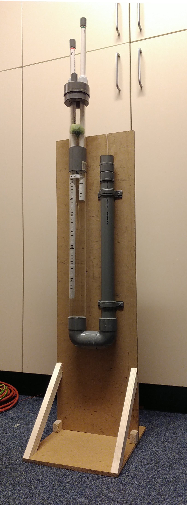

 **OPEN VENTILATOR**

This directory contains build instructions for a level-regulating water column. 

This water column has the following features:

- an overpressure input tube (0 to 45 hPa)
- a PEEP input tube (0 to 20 hPa)
- has an exhaust pipe
- is sealed in practise (not perfectly)
- can be made from materials at DIY shops (transparent tube may be more difficult to source, can be bought in many online shops; semi-transparent can also be used)

Follow the [build instructions](Instructions.odt) to build it.

