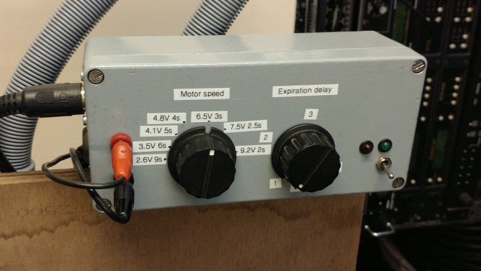
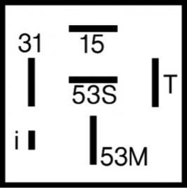
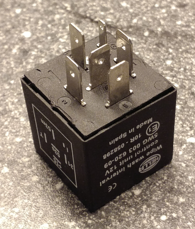
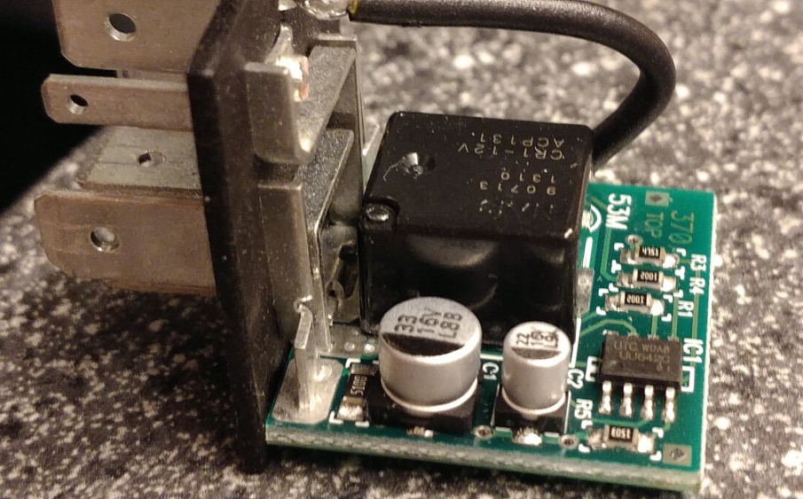
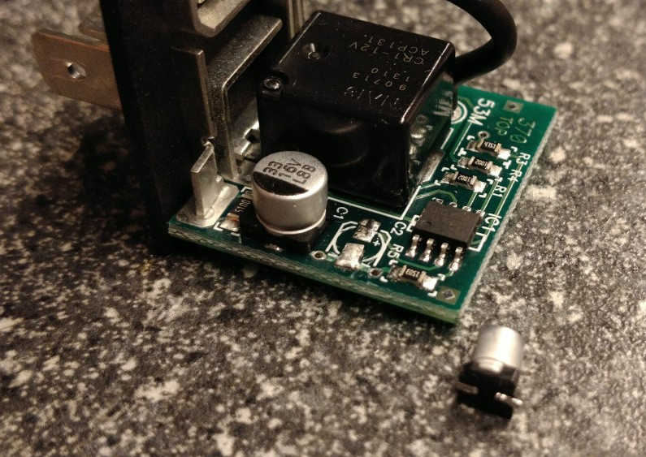
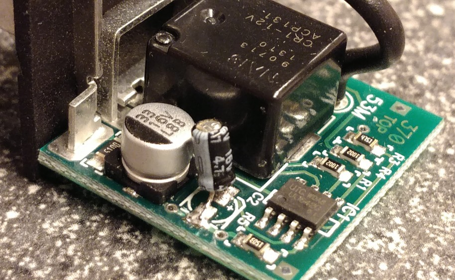
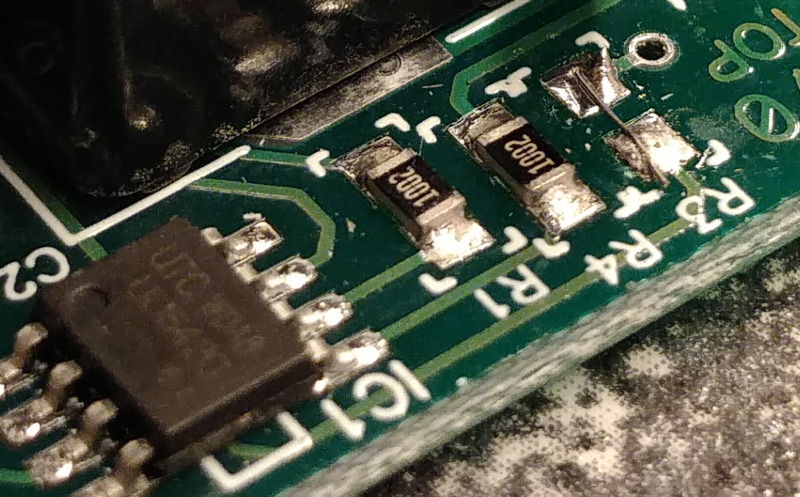
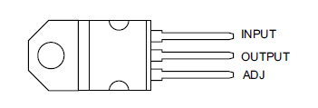
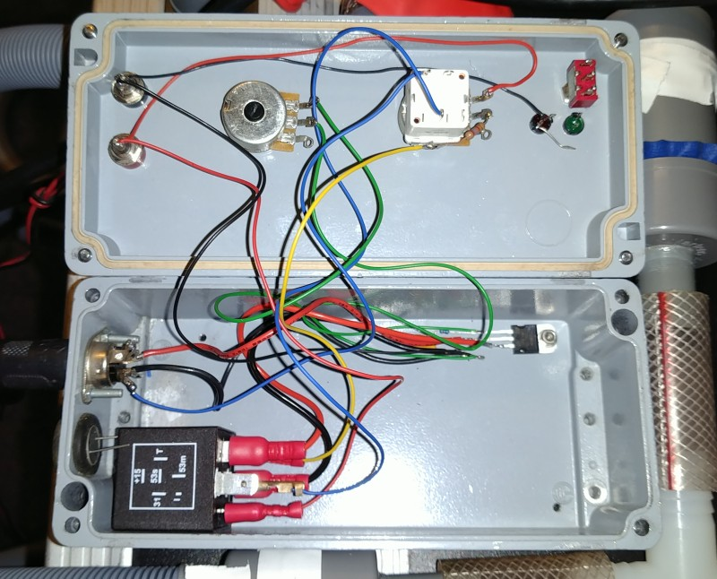

 **OPEN VENTILATOR**

# Interval + voltage motor controller

2020-05-09

This device has the following features:

- Uses modified car windscreen wiper interval relay that can be bought off the shelf or found in scrap cars

- Uses standard 5 A adjustable voltage regulator, which is easy to get and needs only a few extra components

- Controls for interval time and motor voltage

**WARNING: THIS CIRCUIT DOES NOT HAVE ANY ALARMS AND THEREFORE IS UNSAFE TO USE**

# Required materials

- Car interval timer, see first chapter. Found to work are:

    - Hella 5WG 003 620-09 or

    - Hella 5WG 003 620-091 or

    - Hella 5WG 003 620-097

- a capacitor of 4.7 uF, at least 16V

- a resistor of 2.7 k&#x2126;

- some faston flat connectors for the relay pins, unless you choose to directly solder on the relay module pins.

- a potmeter of 25 k&#x2126; linear

- a switch, on/off. A potmeter of 25 k&#x2126; with integrated switch would be best.

- a potmeter of 1 k&#x2126; linear

- 120 &#x2126; resistor (or 150 &#x2126; or 180 &#x2126;, see text below)

- 2x 10uF capacitor

- LD1084 or LM1084-ADJ adjustable regulator

Alternatively take an LM338. It gives a higher voltage drop, but this doesn't matter for most motors as they run fast enough anyway. 

If you cannot get the above regulators and you need **only smaller air volume such as for children**, you can use a regulator that can do only 3A. In this case you can choose to use an LD1085 or LM1085-ADJ (same but 3A), an or LM350 (higher voltage drop and only 3A). 

All mentioned regulators are pin compatible with the well-known LM317 (which is only rated 1.5A, not enough). You need a low-drop regulator if your motor rotates slowly for a given voltage (such as the Mercedes Sprinter motor) and therefore might need all the voltage we can give it. 

- heatsink of less than 3&deg;C/W. Take into account that it has to be mounted onto the enclosure. Alternatively, if you use a metal enclosure, you can use the enclosure to cool the regulator.

- TO-220 isolation set

- M3 bolt and nut long enough to fit through the device, heat sink and enclosure

- 2x knob for potmeter

- enclosure

- red and black 4 mm banana plugs for power input (battery and/or other supply)

- some plug to connect the windscreen wiper motor (2 power contacts and 2 switch contacts; 2 separate plugs can be used too); Some DIN plugs can do 5A; Tuchel plugs are suitable too.

- solder

# Required tools

- Soldering iron for electronics (reduced power, preferably temperature controlled)

- Pliers to strip and cut wire and hold items

- Screw drivers, pliers etc to mount the electronics front panel parts.

- Electrical drill

# Build procedure

## 1. Select car wiper interval timer module

Car interval modules come in many flavors. We are looking for a module with a U641, U642, UU641 or UU642 IC in it. Without opening the device you cannot be certain it is in. We only know new Hella 5WG 003 620-09 modules (sold by number 5WG 003 620-091 and 5WG 003 620-097 as well) have this IC.

You can get other modules and check if they have this IC inside. We think there is most chance with the modules that have the pinout show in this picture.

## 2. Modify car wiper interval timer module

Time: 0:05 to 0:20

We have to modify the interval module to allow for shorter times than are needed on windscreen wipers. In the existing module with a 641 or 642 we have to replace a capacitor and possibly a resistor. Note that your module may look differently. It should have similar components, but older ones may use through hole components instead of surface mount (SMD). After the modification, we can set interval times from 1 to 4 seconds. Together with motor speed control, this should give reasonable control over I/E and frequency.

Open the module and locate the 22 uF capacitor. Solder it off in the following way.

First heat one leg with the soldering iron, and while doing so apply a little force on the cap. It should only be rotated a slight bit. Now do the same on the other side. Repeat this several times. Slowly the capacitor will move up, and at some point will come off. If you bend too much at a time, the tracks on the PCB will come off. We need them.

Solder on the 4.7 uF capacitor. Put the negative side of the capacitor on the same side it originally was. See below picture of an example of a modification.

On the board there is also a resistor of of 2.7k&#x2126; or 4.7k&#x2126;. This determines the minimum interval time. On cars with variable timing, a potmeter on the wiper handle is connected in series with this resistor to set the interval time. On cars without, the resistor is fixed to mostly 4.7k&#x2126;, which may be indicated with code 472 or 4751 on the resistor. We want the shortest time possible, so we reduce the resistor to the specified minimum of 2.7k&#x2126;. However, we can also put this resistor outside the module, because it is connected to the I pin, where we will connect the potmeter to.

To remove the resistor, put enough solder on the soldering iron to touch both sides of the resistor. While touching it, you may need to add some more solder. The resistor will move easily by the touch of the soldering iron after both contacts have reached melting temperature. The solder serves to transport the heat from the iron to the resistor. Watch out not to spread the solder over the PCB.

Solder a resistor of 2.7k&#x2126; on the place of the original. You may also replace it with a short, and put the resistor externally in series with the potmeter. This is easier. See picture. Remember to put the resistor in series with the potmeter later!

## 3. Voltage regulator

This voltage regulator can be used to replace the set of diodes and the 12-pole switch(es). This circuit must come AFTER the interval timer, because the interval timer does not work with low voltages.

The regulators all have the pinout as indicated in the picture here. Mount the regulator on the heatsink first, this solders easily. Mount it with the TO-220 isolation set, to prevent the heatsink from being connected to the circuit.

Create the circuit as indicated below. You can solder smaller components onto the regulator, such as the resistor and the two capacitors.

The maximum voltage is generated with indicated schematic is 11.7 V. At this voltage, the machine will go like cray. You can increase R1 to 150 &#x2126; for maximum 9.6 V output or 180 &#x2126; for maximum 8.2 V output. This is useful if your motor always turns way too fast on the maximum voltage. The exact voltages may vary because they also depend on the maximum resistance of your potmeter. The example box shown in the pictures was used with a Mercedes Sprinter motor, which runs relatively slow, and 150 &#x2126; resulted in a nice speed with up to 30 BPM.

## 4. Assembly

Drill holes into the enclosure to hold the connectors, switches and potmeters. Mount them and wire them according to the schematic. The schematic below is also on EasyEDA: https://easyeda.com/editor#id=|52cfee2ce7384476b625351098e58511

Use double sided tape to stick the relay module to the enclosure, from multiple sides if possible.

Finally, measure the time of interval for various settings, and make indications per second. This way it is easy to calculate I/E and BPM. See the pictures below for an example.

Note about the pictures: The switches and LEDs were in the box already from a previous project and are not used yet. The potmeter has an integrated switch to disable the expiration delay.

# Notes on use

To have backup power, you can run the machine on a lead-acid battery. You can continuously recharge the battery by supplying it with a 13.8 V or 14.0 V power supply. A car battery charger might give too high voltages. 14.0 V is the highest constantly allowable, or up to 14.4 V only for a short time to prevent damaging the battery.

If you use a battery as supply, **it is essential to have a fuse near the battery**. This way a short doesn’t create bigger problems such as fire. Use a fuse of 10 A (red) if you have used a 5A regulator, or one of 5A (tan) if you have used a 3A regulator.

Unfortunately it is not directly possible to set I/E ratio or respiratory rate. Also the interval time is the time from the moment the motor stops, until it starts again, so it’s not possible to set the period or frequency. It’s not even the expiratory time. By measuring the time it takes to do an inspiration and the total period time, these numbers are easy to calculate. Also you will quickly get a feel for it by playing with the controls for some time.

You might want to integrate the alarm system from the Spartan model into this box too. This guards against a stalled motor. A good ventilator however has electronics to guard many more conditions, and in all cases warns doctors by sounding an alarm. This simple motor controller is suitable for experiments only.

For builders not familiar with the terms: How to calculate the I/E ratio and RR (or frequency)

1. Measure inspiration time (the time the machine is pumping air into the lungs)

2. Measure period time (time after which a cycle repeats)

I/E = inspiration time / expiration time
  &nbsp; &nbsp; &nbsp;= inspiration time / ( period time - inspiration time )

Respiratory rate or frequency = 60 / period time, in breaths per minute, BPM
