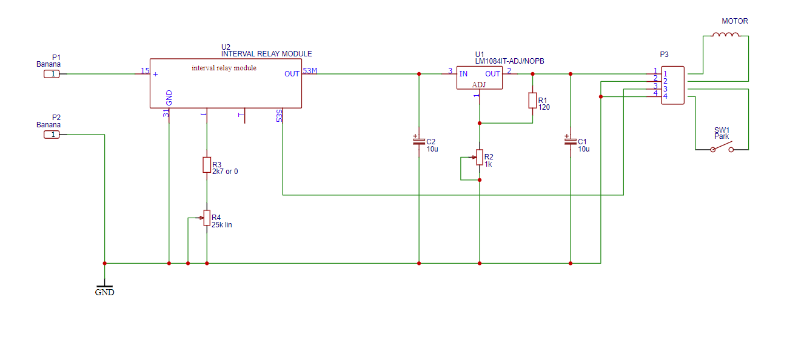

 **OPEN VENTILATOR**

This directory contains a simple driver to control the motor voltage, and allow for an interval before doing the next stroke.

**This part is not part of the standard Spartan model.**

This controller was designed to test hardware. It is not intended to be used on humans.

It sets a single adjustable motor speed. After one revolution, the motor will halt for an adjustable time. This way, respiratory rate and I/E ratio can be set (although not directly). 

The inspiration starts later than the motor starts to compress the bellows, because the pump first needs to overcome the pressure already present. That's why this controller cannot go to 1:1. The actual I/E ratio has been measured to be adjustable from roughly 1:2.5 upwards (at PEEP of 10 cm H2O). Not every combination can be made.

Easily accessible parts have been used. The most difficult one may be the windscreen wiper interval module, which has to be a certain type. The voltage regulator is capable of 5A of current.

**WARNING: THIS CIRCUIT DOES NOT HAVE ANY ALARMS AND THEREFORE IS UNSAFE TO USE**

This circuit uses the following schematic. Read the build description to read how to connect and modify the interval module etcetera.

