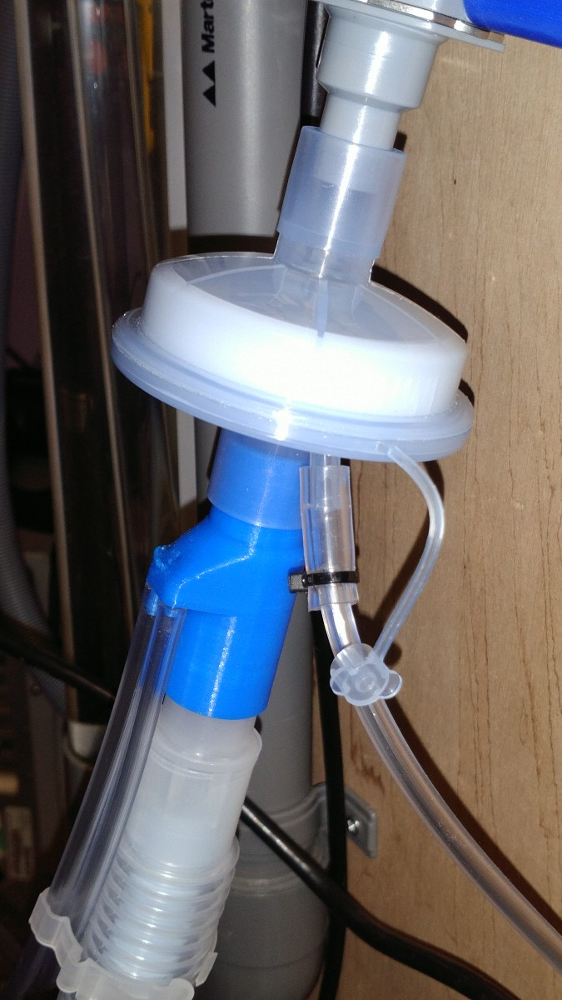
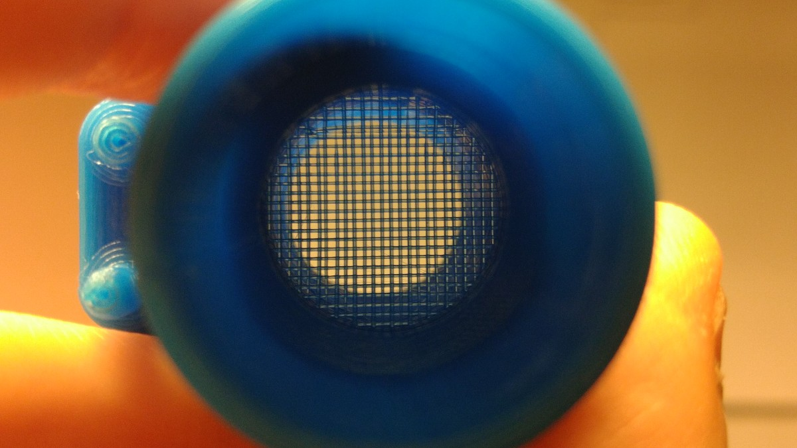

 **OPEN VENTILATOR**

Contains documentation and a printable design for a flow sensor.

**This part is not part of the standard Spartan model.**

Status of this design is: under test.

This design consists of a tube with a grid inside it, a so called Lilly-style flow sensor. A thin tube is present on both side of the grid to measure the pressure on both sides. The design attempts to prevent turbulence from occuring, and have only laminar flow, by not having any steep edges. Laminar flow yields a (more or less) linear relation between flow through and the differential pressure across the grid. The measurement tubes are connected with two 3 mm hoses to the ventilator where the pressure sensors are located. This way, the flow sensor and hoses can be cleaned, and the pressure sensors don't get contaminated because there is no air flow. 

On either tube the pressure at the patient side can also be measured. The pressure difference across the grid is normally less than one hPa when used on the ventilator.

See the [instructions for the 3D-printed valve block](../../03_Pneumatics/PrintedValveBlock/Instructions.md) to learn how to print this properly.

The grid cannot be printed with all slicer software. Slic3r is capable of printing it. Test if you can print the grid well using the test piece in STL/overhang test.stl .

All printable STL's are in the [STL](STL) directory.

All OpenSCAD sources are in the [src](src) directory.

 
_The printed part in blue underneath the air filter (and HME, Heat and Moisture Exchanger)_

 
_The grid as seen through the tube._
