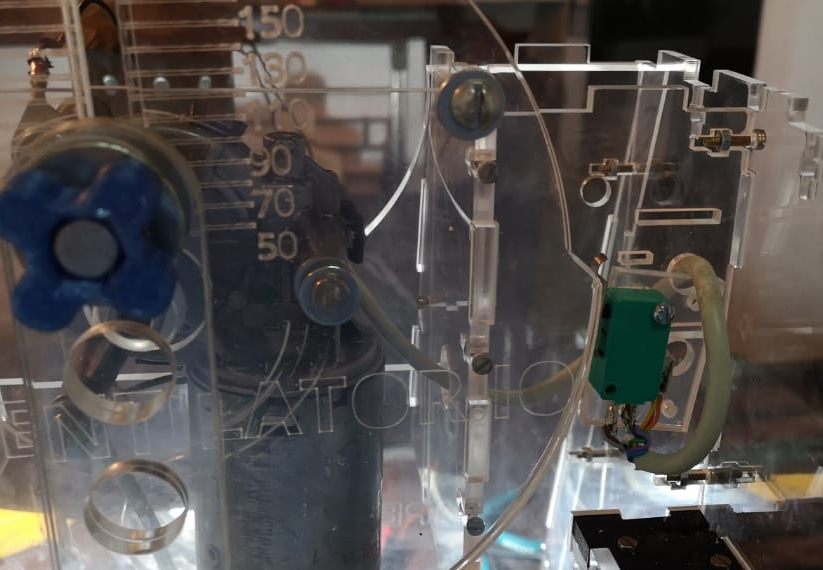

 **OPEN VENTILATOR**

This directory contains a simple circuit to control the motor speed. It supports different speeds during the inspiratory and expiratory phase. 

The voltage is reduced from 12V using an array of diodes. With two 12-position rotary switches it is possible to choose the voltage reductions you need. A micro switch glides over a cam on the motor crank. During the first 180 degrees of motor rotation, rotary switch A is used, and during the second 180 degrees rotary switch B is used.

The schematic is on EasyEDA (TODO: put link here), and a pdf version of the schematic is [here]() (TODO: place schematic!!  can also be an image placed directly in here).

When building the circuit, make sure the components you use can withstand at least 3A, and preferably 5A.

> CIRCUIT GOES HERE
> 
> CIRCUIT GOES HERE
> 
> CIRCUIT GOES HERE
> 
> CIRCUIT GOES HERE
> 
> CIRCUIT GOES HERE
> 

Below some pictures of how the circuitry looks on the machine.

