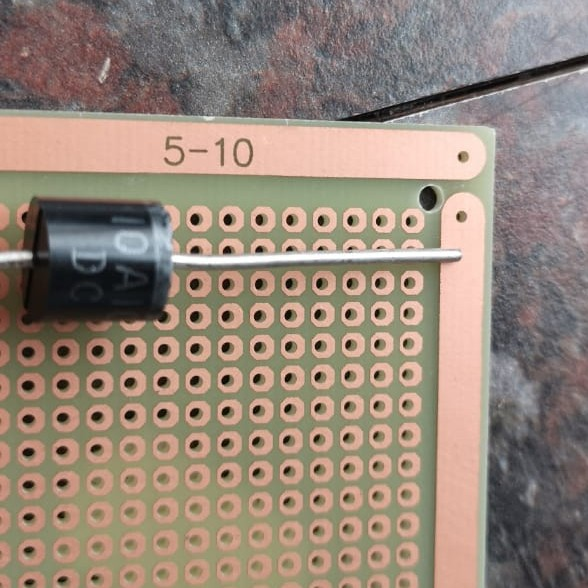
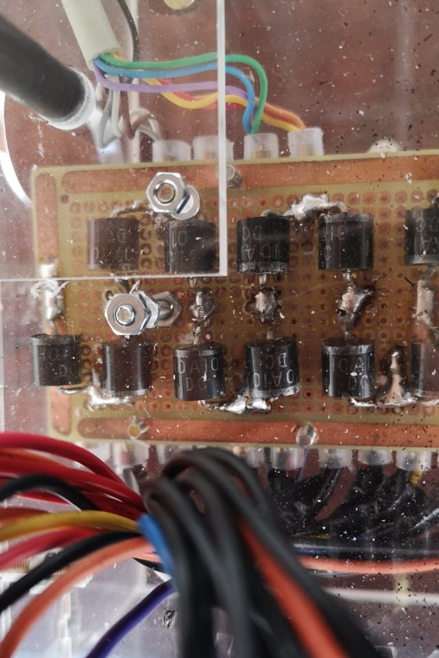
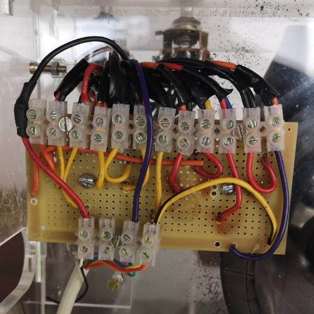
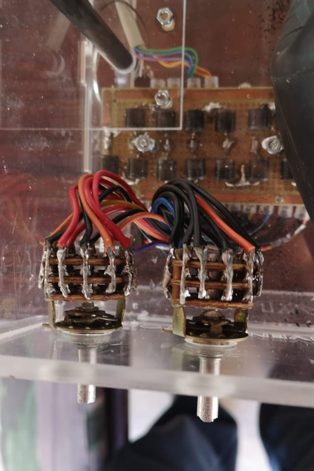

 **OPEN VENTILATOR**

This directory contains a simple circuit to control the motor speed. It supports different speeds during the inspiratory and expiratory phase. 

The voltage is reduced from 12V using an array of diodes. With two 12-position rotary switches it is possible to choose the voltage reductions you need. A micro switch glides over a cam on the motor crank. During the first 180 degrees of motor rotation, the first rotary switch is used, and during the second 180 degrees the second rotary switch is used.

The schematic is [on EasyEDA](https://easyeda.com/editor#id=ed876dfeb8ed4da2bf7233e022f68e6c|04af14d55d5d40428c451de4bf71575d|c1a81347f9064449a645c6809fb1c6f3). 

When building the circuit, make sure the components you use can withstand at least 3A, and preferably 5A. If you cannot find a microswitch for the cam wheel that can do large currents, you can use a small microswitch and have it control a car relay. 

Below some pictures of how you can make the circuitry looks on the machine. It is possible in many ways.

_Phase switch against the cam wheel._

&nbsp;

_A PCB is convenient to hold all diodes in a defined position._

&nbsp;

_Diodes soldered onto PCB._

&nbsp;

_With terminal blocks the diodes can be connected to the wires._

&nbsp;

_The 12-position switches for inspiratory and expiratory speeds, as seen from the side. Multiple switch paths are put in parellel to be able to handle a larger current._
