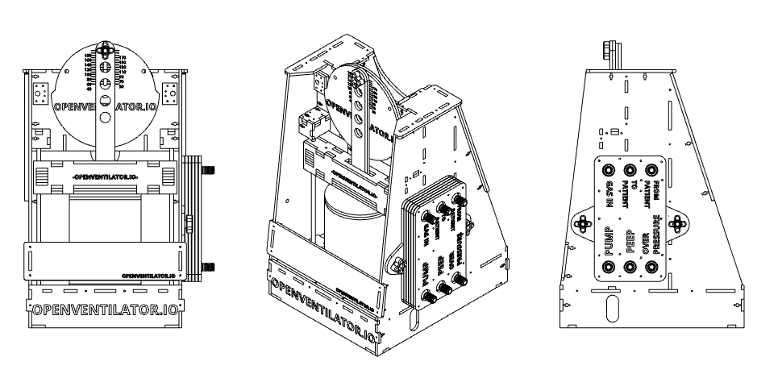

# OpenVentilator

> Welcome to the OpenVentilator project. This is an Open Source Ventilator / Mechanical Respirator for the Covid-19 Crisis.
> Specially Designed for countries in Africa / South America / Middle East and other poor regions in the world

    

 

# :heavy_exclamation_mark::heavy_exclamation_mark:DISCLAIMER 
**PROJECT STATUS:** We still need validation with health regulatory institutions and compliance with clinical requirements. - The tests on Lung Simulators are Sucessfull, limited on application depending on hardware availability but viable on emergency cases

**PLEASE DO NOT USE THIS MACHINE IF NOT NEEDED**, WE DO NOT GUARANTEE THE OPERATION OF THIS MACHINE | THIS MACHINE IS FOR EMERGENCY and HEALTH SYSTEM COLLAPSE SCENARIOS :warning: 

## Main Goal

Design, Build, Validate a reliable Ventilation Medical Equipment Project for people, regions, countries in difficult economical situations with a component-agnostic philosophy. This is why we didn't continue putting efforts into the projects being developed by other teams, who have a different society and economic reality.

**The equipment must have as few industrial parts as possible. If necessary, parts must be easily accessible, even in small towns and villages.**

## Technical highlights

OpenVentilor has adjustable PEEP and maximum pressure threshold, with a wide range. It has adjustable timing for the inspiratory and expiratory phases, allowing a wide range of BPM and I/E. The volume per breath is adjustable mechanically.

## More information

For more info, see here:
- [Specifications](Specifications.md)
- [System description](SystemDescription.md)
- [How to build one](Assembly.md)
- [Project philosophy](projectPhilosophy.md)
- [Research we based on](00_Documentation/Research)

Website: https://www.popsolutions.co/openventilator

Forum (ask anything or report your problems): https://popsolutions.co/forum/openventilator-5

## If you want to help

[First, ** CLICK HERE ** to complete the form please, so we can organize everybody](https://www.popsolutions.co/openventilator-jointheteam) 

Then join the Whatsapp group and talk with Amanda (+55 11 99735-5042 ): https://chat.whatsapp.com/HRMx9xzVdt8Gpmwgm7ZVZ3

This initiative as other projects was born on the [Open Source COVID19 Medical Supplies](https://web.facebook.com/groups/opensourcecovid19medicalsupplies/) Facebook Group by the awareness of the need to create a Ventilator solution for the scarcity plaguing our society worldwide. I contacted Jeremias Almada from Argentina who by that time had presented an Ambu solution and a Cad Design. The idea was interesting but needed improvements.

Since then we tried to establish some development and community standards and evolved the project several times.

## Special thanks to

 - [Jose Ignácio Méndez](https://www.linkedin.com/in/jos%C3%A9-ignacio-m%C3%A9ndez-0ba3ab53/)
 - [Jeremias Almada](https://www.linkedin.com/in/almada-jerem%C3%ADas-43888680)
 - Fabian Franz
 - [Washington Perez](https://www.linkedin.com/in/washingtonperez/) 
 - [Jaqueline Passos](https://www.linkedin.com/in/jaquelinepassos/)
 - [Amanda Pellini](https://www.linkedin.com/in/amanda-cristina-maciel-pellini-9177226a/)
 - [Marguel Gutierrez](https://www.linkedin.com/in/marguelgtz/)
 - [Henrique Aguilar](https://www.linkedin.com/in/henriaguilar/)
 - [Vandeir Soares](https://www.facebook.com/vandeir.soares.7)
 - [Fábio Soares](https://www.linkedin.com/in/fabio-julio-sores-soares-58852630/)
 - [GlobaltTech](http://www.globaltechc.com.br/)
 - [Samtronic](http://www.samtronic.com.br/)
 - [Ethan Moses](https://www.cameradactyl.com/)
 - [Joris Robijn](https://www.linkedin.com/in/jorisrobijn/)
 - [Ramon Bastos]
 - [Faizan Shaikh](https://www.linkedin.com/in/faizanzshaikh)
 - [Matheus Prado]
 - [Leonardo Automni]
 - [Diego Sangiorgi]
 - [Rodrigo Song]
 - [Wendell Mendes](https://www.linkedin.com/in/1endell)
 - [Rodrigo Borges](http://linkedin.com/in/rborges111)
 - [Henrique Nery](https://www.linkedin.com/in/henrique-nery-650216a2/) 
 - [Duit](https://www.duit.com.br/)
 - [Carlos Delfino](https://github.com/CarlosDelfino)
 - [Marcio Dultra](https://www.linkedin.com/in/marciodultra)
 - [Baú da Eletrônica](https://www.baudaeletronica.com.br/)
 - [Três meninas hardware store](https://www.google.com/maps/place/Casa+das+3+Meninas/@-23.5391312,-46.6524764,19.5z/data=!4m5!3m4!1s0x0:0x377232460c40d90d!8m2!3d-23.5391706!4d-46.6524278)
 - [Rogers Guedes]
 - [The MIT guys from this paper](https://web.mit.edu/2.75/projects/DMD_2010_Al_Husseini.pdf): Abdul Mohsen Al Husseini, Heon Ju Lee, Justin Negrete, Stephen Powelson, Amelia Servil, Alexander Slocum, Jussi Saukkonen. 
 - [Draeger for supplying parts to test with]

All our families, wives and husbands that for the last days have been supporting us on our craziness.

All the doctors, nurses and paramedics in the field fighting this common enemy.
