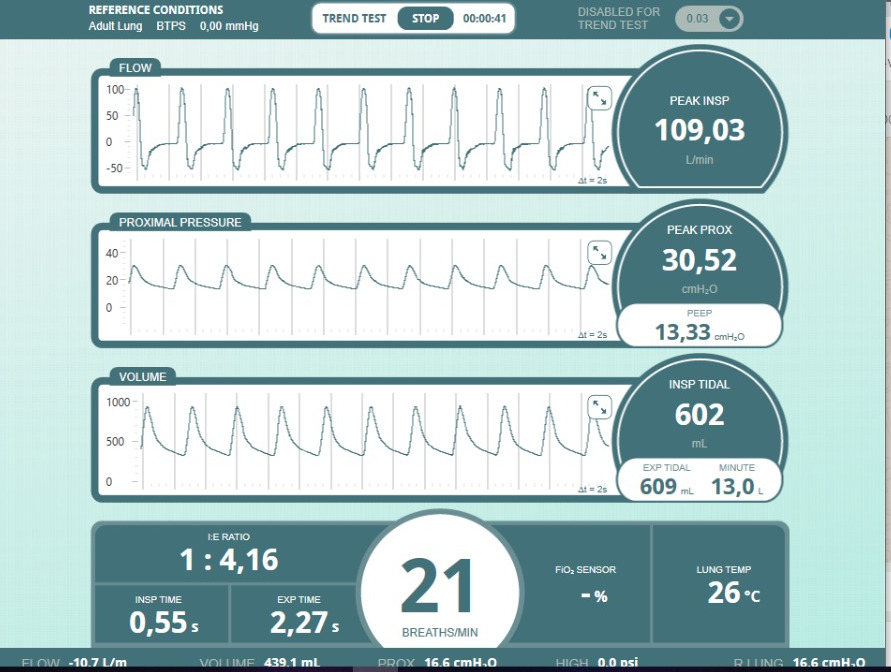
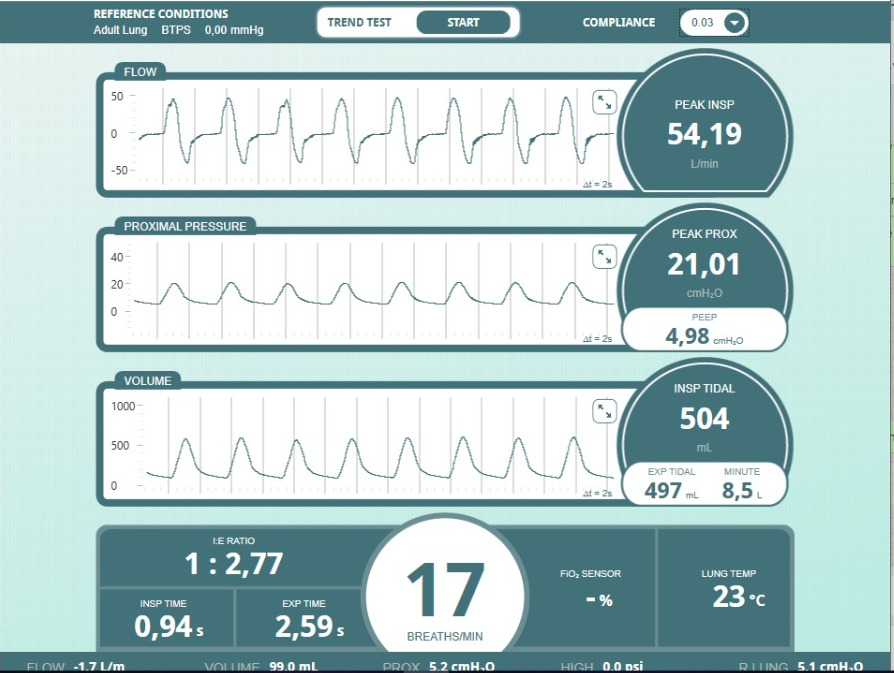

 **OPEN VENTILATOR - Specifications**

### Requirements (MVP)

## Numeric specifications
- Inhalation speed 0.7 to 3 s
- Exhalation speed 1 to 6 s
- Resulting BPM from 10 to 35 cycles a minute
- PEEP Valve control from 1cm/H2O to 30cm/H2O
- Overpressure Valve (adjustable from 1cm/H2O to 50cm/H2O)
- Mechanical Breath Volume Adjustment up to at least 1 liter/breath

## Further Spartan specifications and Mark II prospect

|       Specification         |      Spartan model             |      Mark II                   |
|-----------------------------|:------------------------------:|-------------------------------:|
|Volume control               | Adjustable on crank-wheel      | Adjustable on crank-wheel      |
|Ventilation frequency        | Indirectly by setting speeds   | Electronic native control      |
|Inhale Speed/flow            | 12 position Switch             | Electronicly controlled        |
|Exhale Speed/flow            | 12 position Switch             | Electronicly controlled        |
|Inhale/Exhale ratio          | Indirectly by setting speeds   | Electronic native control      |
|Maximum pressure             | Adjustable by water column     | Adjustable by water column     |
|PEEP Pressure regulator      | Adjustable by water column     | Adjustable by water column     |
|PEEP Pressure indicator      | Optional water column indicator| Digital UI or WaterColumn      |
|Inhale Pressure Sensor       |    Not Available               | Electronic sensor              |
|Exhale Pressure Sensor       |    Not Available               | Electronic sensor              |
|Flow Sensor                  |    Not Available               | Electronic sensor if available |
|Inlet air filtration         | HEPA / Coffee Paper Filter     | HEPA                           |
|Air humidifier               | HME Filter (recommended)       | HME Filter (recommended)       |
|Exhaust filtration           | UV-C Filter + Heat Chamber     | UV-C Filter + Heat Chamber     |
|Oximeter                     | Not available                  | Electronic sensor if available |   
|Heartbeat sensor             | Not available                  | Electronic Sensor if available |
|Assist Control               | No                             | Probably                       |
|Cleanable inside             | Yes                            | Yes                            |

## Success Criteria

Validated Prototype Thanks to [SAMTRONICS](http://www.samtronic.com.br/) This team was super professional and lent us one of the pulmonary simulators that they have available at the company.

Status: The design works. It needs to be built by more people.

	
	

For more results see here: [test results](00_Documentation/SimulatorTest/SpartanV1.0/SpartanV1.0.zip)

