 **OPEN VENTILATOR - System description**

# Sytem description

This document describes the system at top level. From here you can dive lower into various parts.

## Block diagram

The system as a whole consists of the following sections.

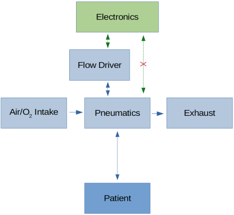

Each of these sections corresponds to a directory on git. Note that in the Spartan model, the electronics is very limited, and does not allow for monitoring. This will be improved in the Mk2 model.

Because OpenVentilator does not want to rely on only one way of creating a working system, there are alternatives for most parts. Some ways are rather primitive, some are more high tech. The focus is on one standard construction, and the resulting design is called the Spartan model. The [Spartan model documentation](OpenVentilator.io_Spartan_Model_Documentation.pdf) describes how to build this standard model. It is built with the following manufacturing methods:
- Many laser cut acrylic parts
- Some 3D printed parts (possible to make them in a different way)
- Primitive electronics (no microcontroller, no IC's)
- Glueing PVC waste water pipes
- Simple tool operations such as cutting, drilling, sanding/grinding and screwing.

The system fulfils the requirements as stated on the [Specifications file](Specifications.md).

## Functional diagram

In more detail, the system looks like this.

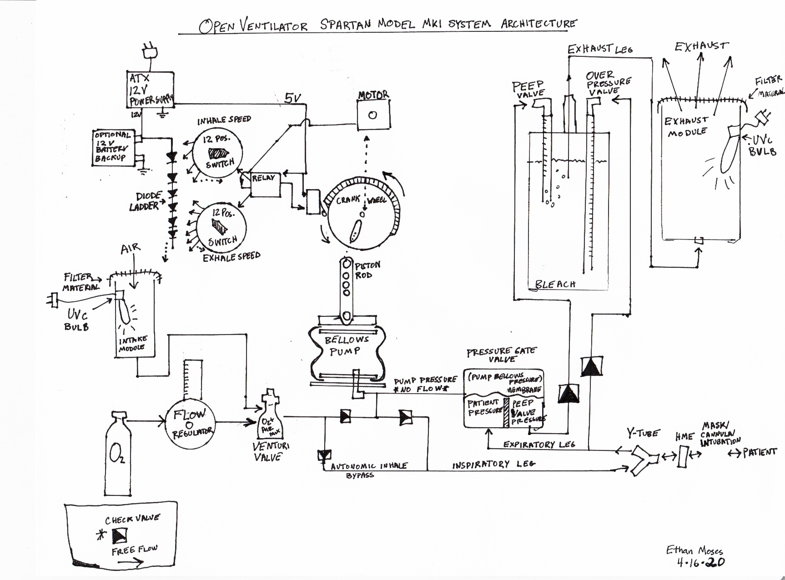

The [Spartan model documentation](OpenVentilator.io_Spartan_Model_Documentation.pdf) describes how it works.

## Functional description

The pump system uses a crank that expands and compresses a bellows. Because it displaces a relatively fixed volume per stroke, and the intervals are very regular, we consider this a Volume Control (VC) mode ventilator. The volume displaced is influenced somewhat by the pressure in the patient's lungs. 

### Electronics

The electronics of the spartan model is very basic and only consist of a few diodes and switches. We have choosen not to do control by a microcontroller (yet), to keep the design simple and produceable anywhere. The Mk II model will have a microcontroller.

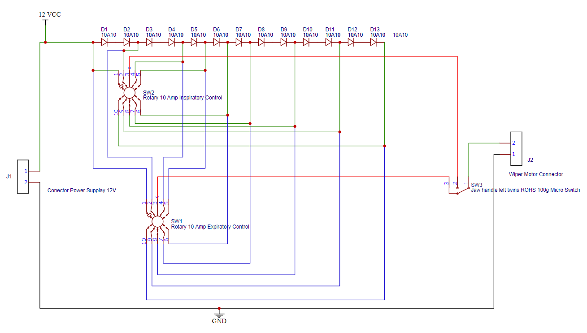

A diode creates a voltage drop when placed in series with a load such as a motor. We have placed multiple diodes in series connected to the power supply, so that we can have higher voltage drops. We have connected switches to these diodes, to be able to select the voltage drop we want to use.

During the inspiration phase, the cam wheel on the motor of the machine does **not** press against the phase switch. In that case the _Inspiration speed_ rotary switch is used to determine the motor speed. 

During the expiration phase, the cam wheel on the motor of the machine **does** press against the phase switch. In that case the _Expiration speed_ rotary switch is used to determine the motor speed. 

### Pneumatics

The full diagram is as follows. Next, you will see explained where air flows during each phase and occurence.

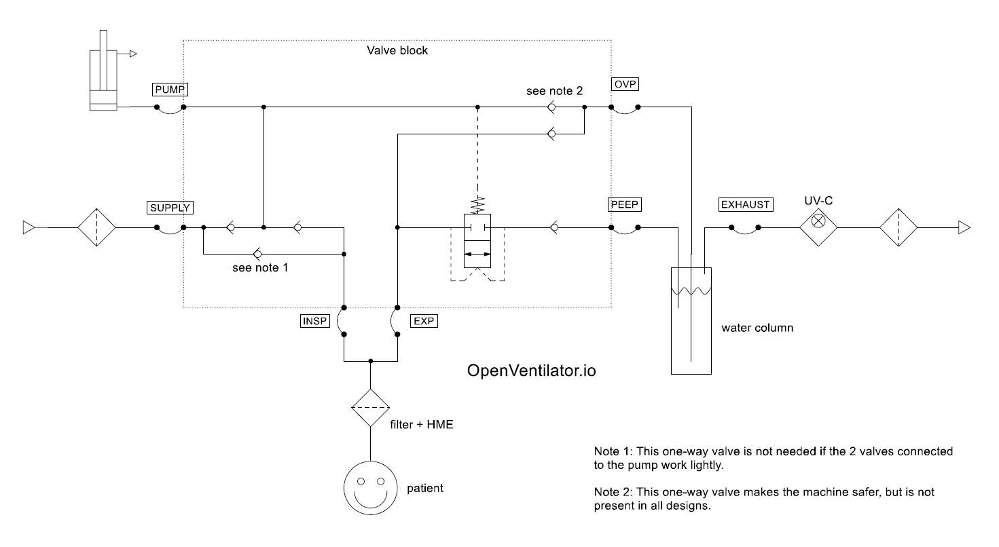

A typical graph of lung pressure on our mechanical ventilator looks as follows.

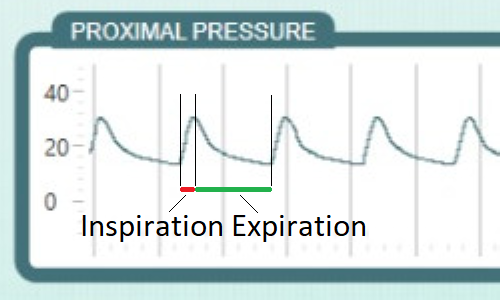

You can see that during the inspiration phases, when air is pushed into the patient's lungs, the pressure rises. Nearing the end of the phase, this stabilizes. The stable high pressure before the end of this phase is called the plateau pressure.

Then the expiration starts. The air is released from the patient's lungs by the pressure of its body and his weight. The ventilator should not release all air from the patient's lungs, but keep a certain pressure on it, called PEEP (positive end-expiratory pressure). 

#### Inspiration phase

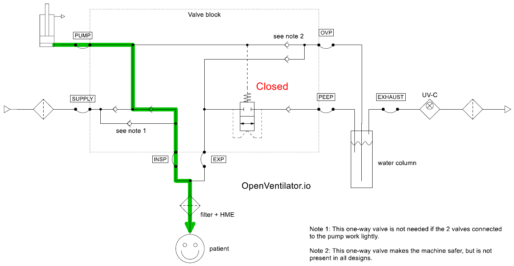

_Figure: Inspiration phase, normal condition_

During inspiration, the pump creates pressure. The one-way valve from the SUPPLY to the PUMP port closes, and the from PUMP to patient opens. The lungs of the patient get filled. This stops, when either the pump has reach the end of its stroke, or the pressure in the respiratory channel of the patient has reached the set maximum pressure. 

The channel from patient to the PEEP port is blocked by the valve that we'll call a transistor valve. This valve closes when there is pressure on the PUMP port, relative to the EXP and PEEP ports. The PUMP pressure is always higher than the PEEP pressure during the inspiration phase, so the valve is closed.

#### Expiration phase

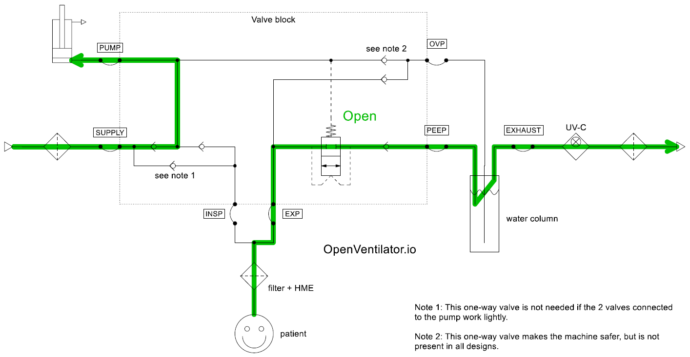

_Figure: Expiration phase, normal condition_

During the expiration phase, the pump is filling itself again with fresh air. The pressure on the pump is low, and as a consequence the one-way valve from SUPPLY to PUMP is open, and the one from PUMP to INSP is closed. 

Because the pressure on the PUMP port is low (even lower than the ambient pressure since it is sucking in air from ambient), the transistor valve is now open. This means that the air from the patient's lungs can now escape via the PEEP port to the water column. Here, the pressure is/becomes equal to the hydrostatic pressure from the tube in the water. The set depth of the tube determines the PEEP pressure. There is a one-way valve in this line, so that the PEEP pressure stays present in the tube for some time after expiration. This prevents excessive water level changes.

#### Special conditions

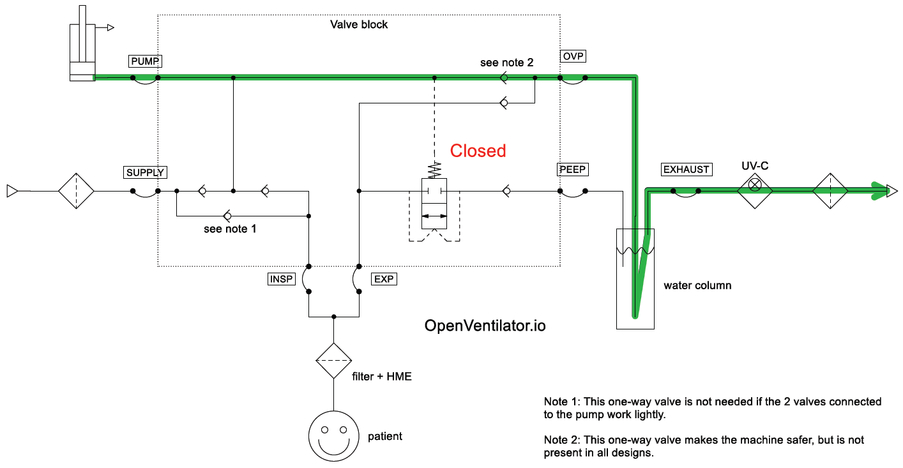

_Figure: Inspiration phase, overpressure condition_

The highest pressure in the pump or lung is always present on the OVP tube. The maximum allowable pressure in the system can be set with the depth of the OVP tube. If the pressure is higher than the hydrostatic pressure of the water at the end of the tube, the air will bubble out. There is a one-way valve in this line, so that the peak pressure stays present in the tube for some time after a pump stroke. This prevents excessive water level changes. In a water column with transparent tubes, you can therefore read the peak pressure on the OVP tube.

The overpressure condition does not damage the machine. The set maximum pressure can even be used to get Pressure Control mode of ventilation, by selecting a large air displacement volume and a limited maximum pressure.

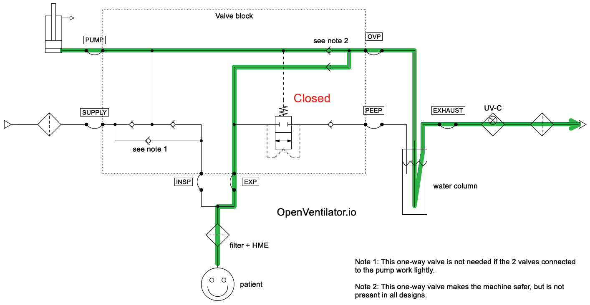

_Figure: Inspiration phase, coughing condition_

If the patient coughs during the inspiration phase, he can push air out through the one-way valve to the OVP port. 

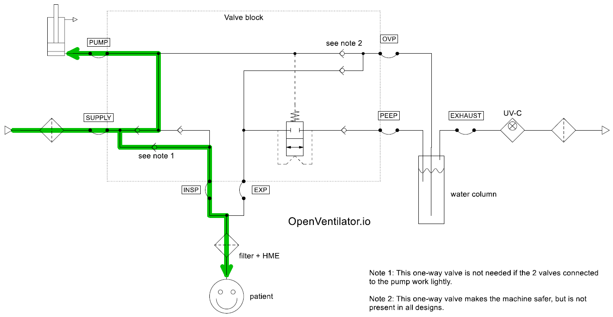

_Figure: Expiration phase, patient inspires condition_

If the patient autonomously inspires while the machine is still completing the expiration phase, the patient can suck in air from the SUPPLY port. If the valve block also has an added one-way valve from SUPPLY to INSP, the inspiration will be easier. 

Note that there is currently **no Assist Control**. This is detection of inspiration attempts by the patient, which should trigger an immediate start of the inspiration phase, in that way assisting the patient in performing a breath.

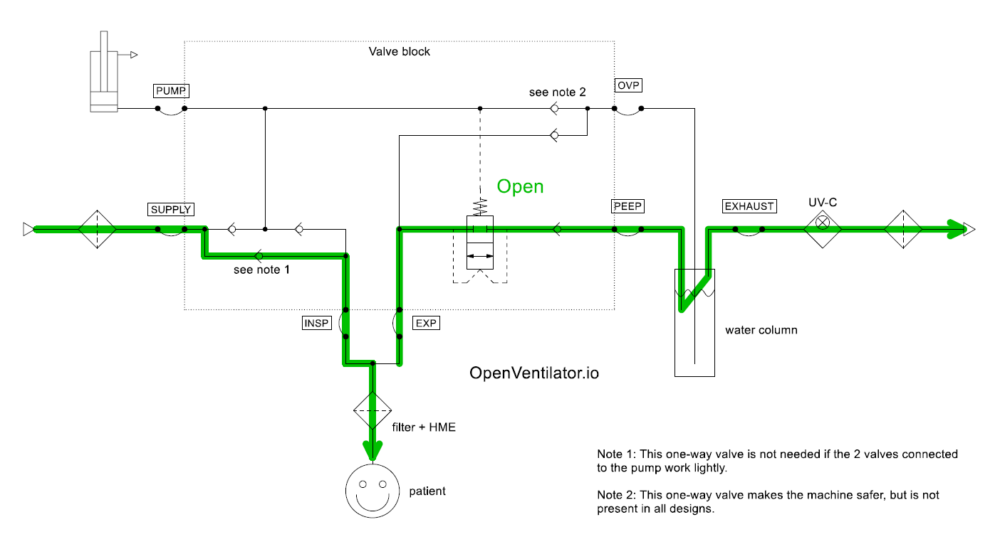

_Figure: Machine off, free respiration_

When the machine is off, the patient can inhale through the one-way valve from SUPPLY to INSP (or the other two valves near those). The patient can exhale through the path via EXP to PEEP port, however, he will need to overcome the set PEEP pressure to exhale. Both paths are drawn in the diagram above.

## Failure Mode and Effects Analysis (FMEA)

Failure mode analysis for the Spartan model and the projected characteristics of the MkII have been analysed. See [FMEA.xlsx](FMEA.xlsx)